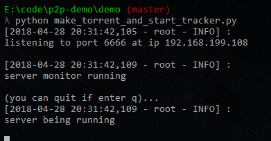
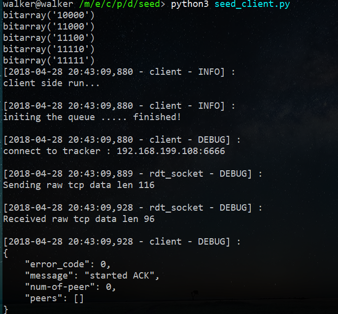
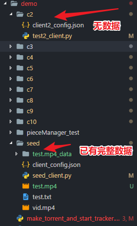
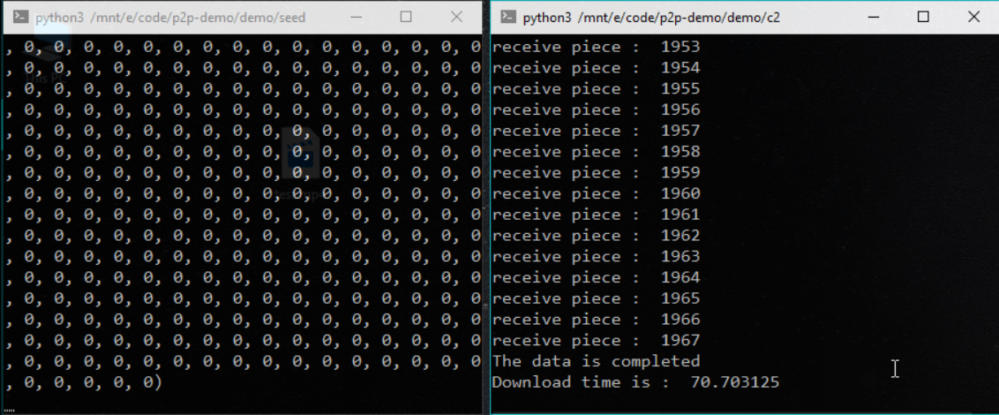
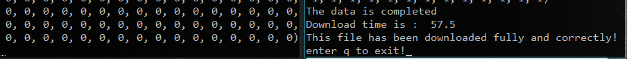
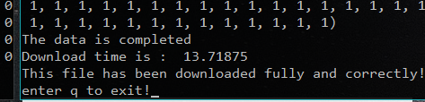
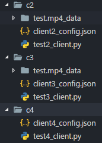
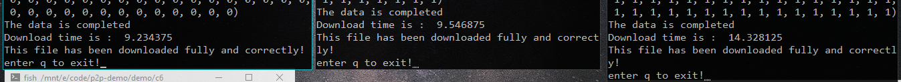

# P2P客户端 <!-- .element: align="center" -->
基于bittorrent协议的实现<!-- .element: align="center" -->

按 → 继续看<!-- .element: align="center" -->


<!-- --- -->

## 目录

1. <a href="#/feature"><u>前言</u></a>
1. <a href="#/install"><u>安装篇</u></a>
1. <a href="#/deploy"><u>部署篇</u></a>
1. <a href="#/use"><u>使用篇</u></a>
1. <a href="#/test"><u>测试篇</u></a>

按 → 继续看

<!-- --- -->

<!-- .slide: id = "feature" -->
## 前言

### 功能特性

1. 做种：向网络中的多个Peer并发地发送数据块
1. 下载：向网络中的多个Peer并发地请求数据块并将数据块整合成完整文件
1. 断点续传：客户端可按q退出，下载到一半的数据块在下一次启动时会自动加载进来

### 技术路线

1. 在PY3原生socket库基础上实现了可靠的数据包传送协议
    1. 解决黏包，半包问题
1. 使用多线程技术支持并发操作，加快下载速度

<!-- --- -->

<!-- .slide: id = "install"  -->
## 1 安装篇

### 1.1 运行环境

本项目在python3.5环境下开发并测试。

服务器与客户端均运行在同一个内网中。

详情请按 ↓

<!-- -- -->


### 1.2 获取源码

运行下面这一条指令获得源码及demo

```sh
git clone https://github.com/YanB25/p2p-demo
```

按 → 继续看

<!-- --- -->

<!-- .slide: id = "deploy" -->

## 2 部署篇

本篇将会告诉你如何部署Tracker服务器

以及运行Client客户端对等方。

详情请按 ↓


<!-- -- -->


### 2.1 Tracker 服务器的部署

需要做三件事情。

1. 制作 Torrent 文件。
1. 导入Server类，运行 Tracker 服务器
1. 向其他客户端分发种子文件

源代码可见：
```py
import os
import sys
# 这里是源代码的路径，可自行修改为对应的相对路径或绝对路径。
SRC_PATH = '../src/backend/'
sys.path.insert(0, SRC_PATH)
from torrent import *# 导入 种子文件 模块
full_file = './seed/test.txt'
# 制作种子文件，默认存到当前目录下
make_torrent_file(full_file)
# 运行server端
os.system("python3 "+SRC_PATH+"server.py")
```


<!-- -- -->

### 2.2 Bittorrent 客户端的部署

1. 从源代码中代入Client类
1. 使用种子文件，客户端配置文件，初始化客户端，并运行之。

```py
import sys
sys.path.insert(0, '../../src/backend/')
from client import *
from torrent import *

file_name = '../test.txt'
test_torrent_file = file_name+'.torrent' # 种子文件相对路径
test_config_file = './client_config.json' # 客户端配置文件
client = Client(test_torrent_file,test_config_file)
client.start()
```

按 → 查看使用方法

<!-- --- -->

<!-- .slide: id = "use" -->
## 3 使用篇

这里以demo的使用为例。

- 在demo中，其他客户端都想下载seed中的test.txt文件。

- 先开启seed,然后开启其他客户端

- 其他的客户端开启后会从tracker得到seed的在线信息，并向seed请求得到test.txt.

首先进入到项目中的demo文件夹中。

```sh
cd p2p-demo/demo
```

详情请按 ↓

<!-- -- -->

### 3.1 启动Tracker服务器

在命令行下执行以下指令:

```sh
# 在demo文件夹下
python3 make_torrent_and_start_tracker.py
```

- 使用本机IP地址更新种子文件

- 启动tracker服务器

- 默认监听6666端口（可在server.py中修改端口号）


<!-- -- -->

启动后的界面。



<!-- -- -->

### 3.2 启动客户端

在启动客户端前，确保种子文件已经更新。

启动客户端的时候，客户端会做两件事情：

1. 读取Torrent文件，并将数据初始化到客户端内部数据中。
1. 获知文件名后，检查"文件名_data/"文件夹下是否有历史数据块，有则加载，无则不管

**由此，区分出做种的Peer与请求文件下载的Peer**

**同时，下载到一半的数据也可以被Peer加载做种**

<!-- -- -->

在命令行执行以下命令：(均在demo文件夹下)

```py
cd seed
python3 seed_client.py
```

```py
cd c2
python3 test2_client.py
```

可启动多个客户端。

<!-- -- -->

启动截图



关于测试结果请按按 → 继续看

<!-- --- -->

<!-- .slide: id = "test" -->
## 4 实验结果说明

我们使用该Bittorrent客户端

完成了以下测试。

测试文件为`test.mp4`,大小为1,007,324字节

- <a href="#/test1"><u>Peer 一对一传送</u></a>
- <a href="#/test2"><u>Peer 多对一传送</u></a>
- <a href="#/test3"><u>3个Peer 相互传送</u></a>
- <a href="#/test4"><u>多个Peer 相互传送</u></a>

按 → 查看测试1结果

<!-- --- -->

<!-- .slide: id = "test1" -->
### 4.1 测试一：Peer 一对一传送

<div>

- 一个客户端已有文件`test.mp4`.
- 另一个客户端没有数据

</div> <!-- .element: style="width:50%; float:left;" -->

<div>



</div> <!-- .element: style="width:50%; float:right;" -->

详情请按 ↓

<!-- -- -->

#### 4.1.1 输出日志对时间的影响

1. 有日志
    1. 
    1. [完整动图](figure/2018-04-29_20-13-19.gif)
1. 无日志
    1. 

<!-- -- -->


|测试类型|时间|
|-|-|
|有日志|70.70s|
|无日志|57.5s|

>结论：日志的输出对时间的影响不可忽略

<!-- -- -->

#### 4.1.2 Piece大小对时间的影响

增大传送的piece大小。（原来为512字节）



<!-- -- -->

|每个Piece大小|时间|
|-|-|
|512字节|57.5s|
|3000字节|13.72s|

>结论：
>1. 在目前的条件中，Piece越大，总传送的时间越短
>1. 一般而言，更大的文件需要更大的Piece

<!-- -- -->

#### 测试结果

1. 日志会影响时间的计算，此后均采用无日志方式测试
1. piece大小会影响传送时间，此后采用3000字节为一个piece

按 → 查看*测试2:多对一*结果

<!-- --- -->

### 4.2 测试二：多对一

- 多个Peer同时发给同一个客户端
- 目的：查看是否能够提速
- 测试过程：从2对1，测试到9对1

详情请按 ↓

<!-- -- -->

*三次测试环境测试过程的完整视频*
1. [win10第一次](video/2to1-9to1.mp4)
2. [mac](video/2to1-9to1_lxr.mp4)
3. [win10第二次](video/2to1-9to1-2.mp4)

按 ↓查看示例录屏

<!-- -- -->

<!-- .slide:  data-background-video="./video/2to1-9to1.mp4" data-background-video-loop data-background-video-muted -->

<!-- -- -->

|测试类型|传送时间|
|-|-|
|1 to 1|13.72s|
|2 to 1|5.23s|
|3 to 1|2.36s|
|4 to 1|2.59s|
|5 to 1|2.17s|
|6 to 1|1.42s|
|7 to 1|1.36s|
|8 to 1|1.22s|
|9 to 1|1.03s|

<!-- -- -->

#### 测试结果

- 多对一的情况下，多个Peer同时给一个Peer传送数据，能够起到加速的效果
- 在Peer数量只有1-2个时，提速效果明显

按 → 查看*测试3：Peer相互发送*结果

<!-- --- -->

### 4.3 测试三:Peer相互发送

<div>

- c2:有后50%数据
- c3:有前50%数据
- c4:没有数据

</div> <!-- .element: style="width:50%; float:left;" -->

<div>



测试过程可见[动图](figure/2018-04-29_21-18-44.gif)

</div> <!-- .element: style="width:50%; float:right;" -->

详情请按 ↓

<!-- -- -->

测试结果如图所示。



|测试Peer类型|完成时间|
|-|-|
|具有后50%数据的Peer|9.23s|
|具有前50%数据的Peer|9.54|
|没有数据的Peer|14.23s|

<!-- -- -->

**测试结果**

1. Peer1，Peer2：同时发送Piece和请求Piece
1. Peer3：只接受Piece
1. 文件的正确性得到检验，确保传送与保存过程无错误

按 → 查看*测试4:多个Peer相互发送*结果

<!-- --- -->

### 4.4 测试四：多个Peer相互发送

<div>

**测试环境**

1. 5个客户端，每个有70个Piece，
1. 保证5个客户端所拥有数据块能够合成完整的文件。

</div> <!-- .element: style="width:50%; float:left;" -->

<div>

[测试过程完整视频](video/5to5.mp4)

</div> <!-- .element: style="width:50%; float:right;" -->

<!-- -- -->

#### 实验结果

1. 5个客户端能够使用多线程技术，并发地处理发送文件与接收文件。
1. 5个客户端均接收到完整的数据块，并组合成正确的文件

按 → 查看项目总结

<!-- --- -->

## 项目总结

- 并发传输没有出现冲突
- 文件正确性经校验