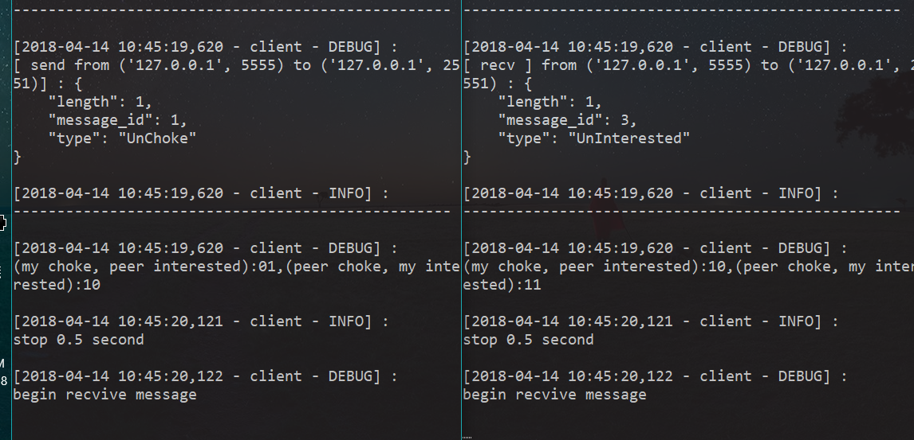

# 思考
在客户端的实现中，现在想要解决的问题是

1. 能够从多个客户端下载同一个文件。
1. 能够在下载文件的同时，接受多个客户端的request并且给别人传文件。

前提：1. 每个客户端都有一个监听端口，通过这个端口获得与不同客户端连接的socket。

下面的问题是，用一个socket与一个客户端通信是否足够

需要面对的一种情形是，我有文件的前50%，他有文件的后50%，此时其实可以我们相互传，那么这个时候，到底是使用一条tcp连接进行双向传输，还是使用两条tcp连接分别握手传输呢？
## 双TCP链接
1. 讨论一下两条tcp连接的可行性
    1. 两条tcp连接的话，也就是说，一条连接是我主动向客户端请求文件得到的，另一条连接是客户端主动向我请求文件得到的
    1. 由于请求的时候会分配一个随机端口号，所以无论是我还是客户端都能够获得两个socket，然后将这两个socket分别用不同的方法处理即可
    1. 然后，这样的话，也就是说客户端需要有一个socket一直负责监听，一旦有请求（当然是别人向我请求文件），则产生一个发送文件的socket，放到发送文件的队列中
    1. 可以分为这三类线程程
        1. 监听线程：负责得到新连接的socket，并放到发送文件的socket队列中
        1. 发送文件线程：每一个线程维护一个发送文件的socket，这个socket里面的状态转换已经搞定啦
        1. 接受文件线程：同上，然后维护对不同主机请求文件的多个socket对应多个socket，状态转移也ok
    1. 实现上也似乎还可以
    1. 有一个问题
        1. 客户端的消息发送状态转移机制，是通过向对应的socket发送消息做到的
            1. 那么两个客户端之间有可能有两条tcp连接，有没有消息既会影响发送文件又会影响接收文件呢？
            1. 如果有的话，但是消息我只能发往其中一个socket，这就出现问题了。
            1. 看了一下，似乎并没有这样的消息
        1. 监听进程的accept()函数会阻塞，多进程能否在该函数阻塞的时候运行其他进程，而有新连接事件时触发这条进程的运行呢？（我觉得是有办法的）
## 单TPC链接
1. 讨论一下客户端之间一条tcp连接的可行性
    1. 一条tcp连接的话，这条tcp连接是双向的通道，就要同时处理发送文件和接受文件
    1. 前文的两条连接的状态转移是很简单的，只是二元组的简单转移，现在两条tcp连接合为一条，也就是说，连接的状态是一个四元组，理论上四元组的状态转移也可以画出来，可能就是有点杂
    1. 今天颜彬讲到将这个状态转移变成二元组（我是否发你？，你是否发我？），现在想想这个做法的可行性
    1. 可以分为这两类进程
        1. 监听进程（同上）
        1. 客户端之间相连的进程：
            1. 该进程需要描述客户端之间的tcp连接的状态的转移
    1. 客户端之间相连的进程如何实现？
        1. 状态转移有点复杂，画了一下画不下去
    1. 问题：
        1. 客户端向另一个客户端请求文件的时候，需要先看看自己与该客户端有没有建立已有的连接？
            1. 如果不检查的话，就回到了两条tcp路线的情况
### 可能的思路和流程
把request的接收和发送整合到同一个线程（同一个函数）中完成。
具体细节：
考虑到，一个peer**不会主动**向对等方传送文件块。传送文件块必然是因为对等方**显式地向我请求文件块**。这就给单线程做request的接受和发送提供了可能。

伪代码实现
``` python
def task():
    # 双方建立链接
    socket = connect(ip, port)

    # 双方同步bit field
    # 自旋等待，直到得到对方bitfiel
    socket.send(my-bit-field)
    peer_bitfield = waitAndGetBitfield()

    # 双方同步状态
    # 自旋等待，直到得到对方的choked和interested
    socket.send(no-choked)
    socket.send(interested)
    peer_is_choked = waitAndGetChoked()
    peer_is_interested = waitAndGetInterested()

    # 死循环读socket
    while True:
        msg = socket.read()
        # 在这里自旋地等待消息到达
        if not msg: continue

        # 得到对方的request
        if message is request:
            # 在这里做socket的上传
            socket.send(blocks)

        # 得到对方的block
        # 继续请求下一个block,直到无block到达
        # （例如被对方choked）
        if message is block:
            # 这里也需要做socket的上传
            socket.send(request-next-block)

        if message is no-choked and my-interested:
            # 在双方同步状态完成之后，必有其中一方对另一方发送了no-choked消息
            # （或双方都向对方发送了no-choked)
            # (否则，直接把链接断掉吧...)
            # 这个no-choked消息会在这个if语句起作用，让本client发送第一个request-block
            socket.send(request-block)

        if message is type1:
            do type 1 work
            change my state
            # 如果必要的话
            # socket.send(my-state)
            # 如果必要的话
            # socket.close() 
        if message is type2:
            do type 2 work
            change my state
            # 如果必要的话
            # socket.send(my-state)
            # 如果必要的话
            # socket.close()

```

更进一步地，我们将`task()`封装进多线程类里。
``` python
class Task(threading.Thread):
    ...

    def __run__(self, socket):
        # 将上面的task函数放到这里
        # 把相关的内容（例如socket）传进来

```

这时，我们考虑一下。socket的来源有两种。来源于自己主动建立的链接，或来源于对方建立的链接。

但无论是哪种情况，这两个socket应该是对外等价的。
即，进入了socket后，没有必要再区分这个链接是谁建立的。双方都有`send`和`read`的权利。

可以把程序的主体设计如下
``` python
for peer in top-4-peer-list:
    # 来源于自己建立的socket
    socket = socket.connect(peer)
    # 根据socket创建多线程类
    task = Task(socket)
    # 开启多线程
    task.start()

while True:
    # 来源于对方建立的socket
    socket = server_socket.accept()
    # 无差别地创建多线程类
    task = Task(socket)
    # 无差别地开启多线程
    task.start()
```

例子：
假设peerA向peerB建立链接。
peerA的socket来源于第一个for循环。
peerB的socket来源于第二个while循环。

注意到这两个socket跑的是同一份代码，这份代码中同时包含了读socket和写socket两部分内容。


## 出现的问题

丢包情况的出现



分析了一下，不是很清楚为什么。
但是注意到，可能有与时间相关的问题，因此我加了一个随机延时。

## 待增加功能

### 数据块的管理
1. 连接内，不负责文件的保存，连接只与piece_manager交互，将收到的数据块给piece_manager
1. 连接关闭的时候，数据块不一定能够收齐。
1. 客户端主进程，需要负责管理piece_manager,应该有这样一个轮询：如果完整，将完整文件存到指定路径，并且修改一个状态位。

如果数据块不完整，可以考虑使用另一种模式将数据存下来：建一个以文件哈希值为名字的文件夹，里面使用索引命名已经收到的数据块。